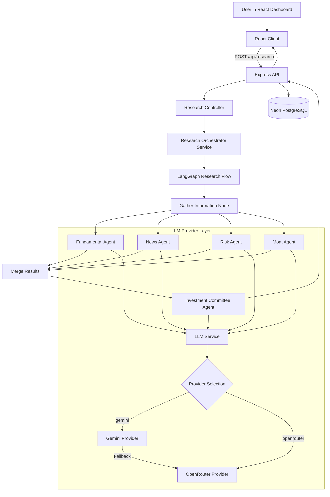
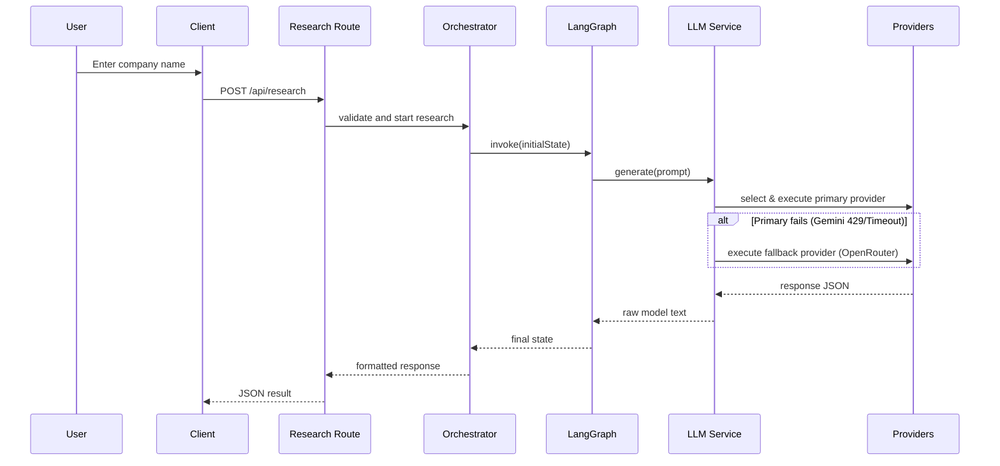

# AlphaLens AI Architecture

This document goes one level deeper than the main README. Its purpose is to explain the runtime flow, the reasoning behind the folder structure, and the design choices that make the project easier to defend in an interview.

## System Architecture



## Backend Request Flow



## Folder Reasoning

### Backend

- `config/` exists to isolate environment, LLM configurations, and database singleton wiring from business logic.
- `providers/` isolates vendor-specific SDK concerns (e.g. LangChain Google GenAI vs OpenRouter REST request headers).
- `controllers/` exist to keep HTTP concerns thin.
- `services/` exist to hold orchestration, LLM provider routing, and deterministic business logic.
- `agents/` exist to wrap focused AI responsibilities.
- `graph/` exists so state and workflow stay explicit rather than being hidden inside controller code.
- `prompts/` exist because prompts are part of the product logic and deserve versioned ownership.
- `middleware/` exists to centralize Express behaviors such as 404 and error formatting.
- `validators/` exist to keep malformed requests from leaking into deeper layers.
- `database/` exists to prepare for persistence without mixing SQL into unrelated files.

### Frontend

- `pages/` hold route-level screens because routing concerns are different from reusable UI concerns.
- `components/` hold reusable presentation units.
- `hooks/` hold async and stateful UI logic.
- `services/` keep Axios calls out of components.
- `context/` holds cross-page state, in this case lightweight search history.
- `charts/` separates visualization code from general UI code.

## Pluggable LLM Provider & Model Router Layer

Instead of tightly coupling our agents directly to a single LLM or SDK, we've implemented an **Intelligent Model Router** on top of the **Provider Pattern**.

### Why the Provider Pattern & Model Router is Better

1. **Vendor & Model Decoupling (Open/Closed Principle)**: The agents and orchestration graph are completely oblivious to which model is serving their request. We can change the model assigned to any agent dynamically in `.env` without changing a single line of agent code.
2. **Task-Specific Optimization (Cost & Latency Reduction)**:
   - **Narrow tasks** like extracting financial metrics or analyzing risk factors are routed to **`deepseek/deepseek-chat`** which has a highly analytical structure and is incredibly cost-efficient (saving up to 90% of token costs).
   - **Text-heavy tasks** like summarizing news articles are routed to **`qwen/qwen3`** (or configured instruction models) which has high throughput and fast token generation.
   - **High-order reasoning tasks** like synthesizing the final recommendation are routed to **`google/gemini-2.5-flash`** because the Investment Committee requires premium reasoning and a large context window to cross-reference multiple reports.
3. **Resilient Multi-Stage Fallbacks**: If the primary model for the Committee Agent fails (e.g. 429 quota exhaustion or network timeout), the LLM Service automatically falls back to `deepseek/deepseek-chat`, and if that fails, to `qwen/qwen3`, preserving system availability.
4. **Consistent Interface**: The LLM Service guarantees a standardized response format:
   ```javascript
   {
       success: true,
       provider: "openrouter",
       model: "deepseek/deepseek-chat",
       text: "..."
   }
   ```

## Why The Recommendation Is Deterministic

The key architectural choice is that the final decision is score-driven, not model-driven.

That means:

- the numeric result can be explained line by line
- prompt drift has less impact on the final action
- the system is safer to evolve
- interviewers can see a real engineering decision rather than an AI demo shortcut

## Why The Agents Are Separate

The agents are split because investment research naturally decomposes into different lenses:

- fundamentals
- news sentiment
- risk
- moat quality
- final committee synthesis

If all of this lived in one prompt, it would be harder to debug and much harder to explain.

## Current Trade-Offs

- Finance and news providers are still mock-backed so the architecture can be built before provider lock-in.
- PostgreSQL schema is defined early, and runtime persistence is fully integrated using Neon and Prisma.

## Interview Summary

A concise interview explanation:

“I separated orchestration, scoring, prompts, and UI rendering so each layer had one responsibility. The backend uses a LangGraph workflow for focused research steps, while the final recommendation is deterministic. Furthermore, I built a pluggable LLM Provider Layer using the Provider Pattern. This decouples our business logic from vendor SDKs, allowing us to route requests to Gemini or OpenRouter dynamically and handle rate-limiting or quota errors via automatic transparent fallbacks without crashing the app.”
