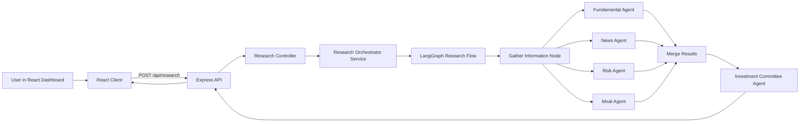
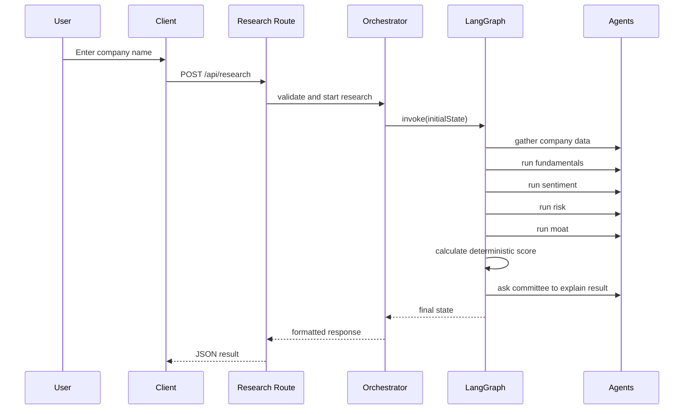

# AlphaLens AI Architecture

This document goes one level deeper than the main README. Its purpose is to explain the runtime flow, the reasoning behind the folder structure, and the design choices that make the project easier to defend in an interview.

## System Architecture

## Backend Request Flow

## Folder Reasoning

### Backend

- `config/` exists to isolate environment and dependency wiring from business logic.
- `controllers/` exist to keep HTTP concerns thin.
- `services/` exist to hold orchestration and deterministic business logic.
- `agents/` exist to wrap focused AI responsibilities.
- `graph/` exists so state and workflow stay explicit rather than being hidden inside controller code.
- `prompts/` exist because prompts are part of the product logic and deserve versioned ownership.
- `middleware/` exists to centralize Express behaviors such as 404 and error formatting.
- `validators/` exist to keep malformed requests from leaking into deeper layers.
- `database/` exists to prepare for persistence without mixing SQL into unrelated files.

### Frontend

- `pages/` hold route-level screens because routing concerns are different from reusable UI concerns.
- `components/` hold reusable presentation units.
- `hooks/` hold async and stateful UI logic.
- `services/` keep Axios calls out of components.
- `context/` holds cross-page state, in this case lightweight search history.
- `charts/` separates visualization code from general UI code.

## Why The Recommendation Is Deterministic

The key architectural choice is that the final decision is score-driven, not model-driven.

That means:

- the numeric result can be explained line by line
- prompt drift has less impact on the final action
- the system is safer to evolve
- interviewers can see a real engineering decision rather than an AI demo shortcut

## Why The Agents Are Separate

The agents are split because investment research naturally decomposes into different lenses:

- fundamentals
- news sentiment
- risk
- moat quality
- final committee synthesis

If all of this lived in one prompt, it would be harder to debug and much harder to explain.

## Current Trade-Offs

- Finance and news providers are still mock-backed so the architecture can be built before provider lock-in.
- Gemini integration is real, but the system falls back gracefully when the API key is missing.
- PostgreSQL schema is defined early, but runtime persistence is deferred until the core flow is stable.

## Interview Summary

A concise interview explanation:

“I separated orchestration, scoring, prompts, and UI rendering so each layer had one responsibility. The backend uses a LangGraph workflow for focused research steps, while the final recommendation is deterministic. That balance gives us explainability, easier testing, and cleaner long-term maintenance.”
